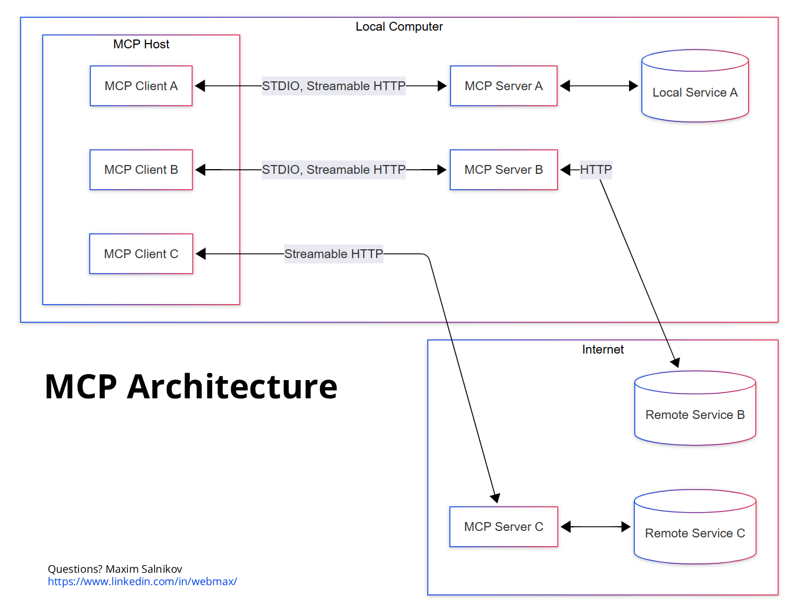

# MCP Architecture Diagram

## Rendered:




## Source:

```mermaid
flowchart LR
 subgraph Internet["Internet"]
        S3["MCP Server C"]
        D3[("Remote Service C")]
        D2[("Remote Service B")]
  end
 subgraph subGraph1["MCP Host"]
        C1["MCP Client A"]
        C2["MCP Client B"]
        C3["MCP Client C"]
  end
 subgraph subGraph2["Local Computer"]
        subGraph1
        S1["MCP Server A"]
        S2["MCP Server B"]
        D1[("Local Service A")]
  end
    S3 <--> D3
    C1 <-- STDIO, Streamable HTTP --> S1
    C2 <-- STDIO, Streamable HTTP --> S2
    S1 <--> D1
    C3 <-- Streamable HTTP --> S3
    S2 <-- HTTP --> D2
